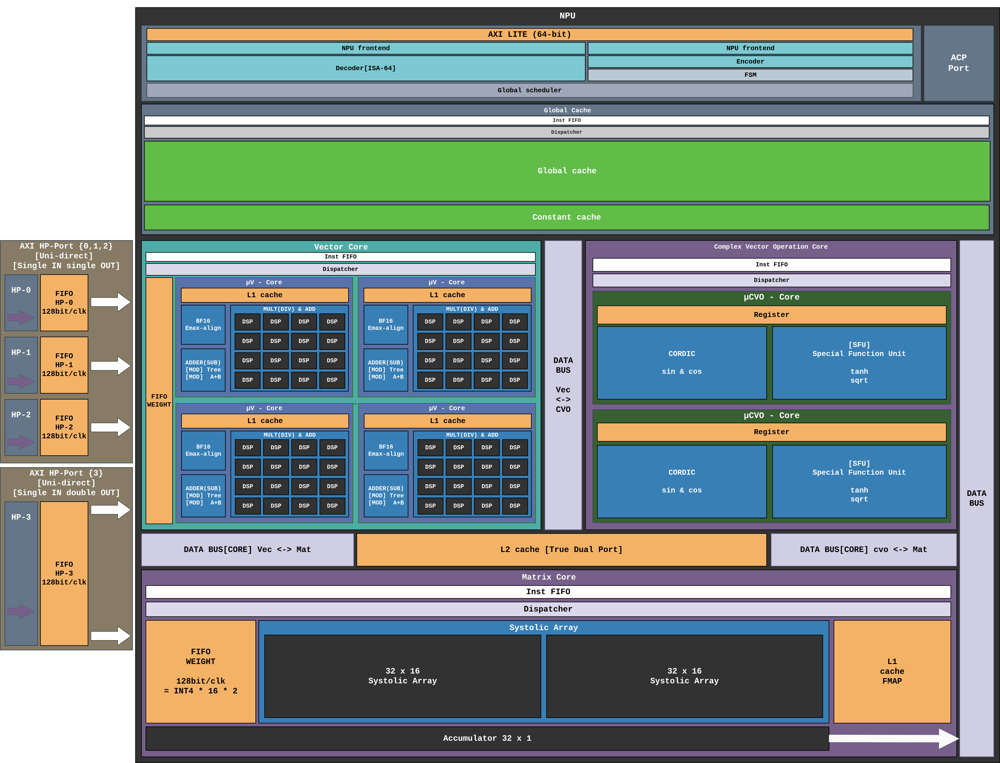
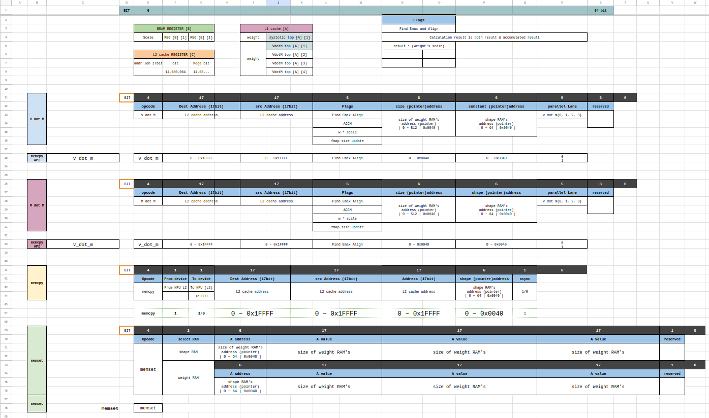

# uXC — Bare-Metal Transformer Accelerator on FPGA


Custom NPU for running the **Gemma 3N E4B** language model on the Xilinx Kria KV260 FPGA,
bare-metal at 400 MHz. No OS, no PetaLinux.

Software baseline: [llm-lite](https://github.com/hwkim-dev/llm-lite) (x64 CPU reference implementation).

-----

## Project Overview

uXC is a custom SystemVerilog-based Neural Processing Unit (NPU) engineered from the ground up to accelerate the quantized Gemma 3N E4B Large Language Model on a bare-metal Xilinx Kria KV260 FPGA. The architecture is meticulously designed to push the absolute physical constraints of the KV260 platform, exploiting its 1,248 DSP48E2 slices and 144 Block RAMs (BRAMs) to the limit.

This project encompasses a full-stack hardware-software co-design approach. It seamlessly integrates a SystemVerilog hardware accelerator, a Python-based Golden Model for Trace-Driven Verification, and a high-performance AXI Direct Memory Access (AXI DMA) pipeline to overcome inherent edge-device memory bottlenecks.

-----

## NPU Architecture Overview



```
AXI-Lite (HPM) ──► NPU Controller ──► Global Scheduler
                                              │
              ┌───────────────┬───────────────┼───────────────┐
              ▼               ▼               ▼               ▼
       Vector Core      Matrix Core       CVO Core      mem_dispatcher
       (GEMV_top)    (GEMM_systolic_top)  (CVO_top)         │
        HP2/3 weights   HP0/1 weights    stream via    L2 URAM cache
                                         CVO bridge   (114,688 × 128-bit)
              └───────────────┴────────────── ─ ─ ─ ─ ─ ─ ─ ┘
                       preprocess_fmap (ACP fmap in)
```

The NPU is organized into three primary compute tiers connected via a shared **L2 True Dual-Port cache** and internal data buses:

- **Vector Core:** Four μV-Cores for parallel GEMV operations, each with a dedicated L1 cache and BF16 Emax-align unit. Fed by AXI HP-Ports 2 and 3 (32 INT4 weights/clk each).
- **Complex Vector Operation (CVO) Core:** Handles non-linear activation functions (GELU, sqrt, exp, sin/cos via CORDIC and SFU). Connected to the L2 cache via a dedicated CVO stream bridge (`mem_CVO_stream_bridge`).
- **Matrix Core:** A 32×32 Systolic Array for GEMM operations. Weights supplied via AXI HP-Port 0/1 at 128-bit/clk. FMap is cached in a dedicated L1 FMAP cache.

-----

## Quantization Strategy: W4A16 with BF16 Activations

The core compute path operates at **W4A16 precision**:

|Data                    |Type |Width |Notes                                  |
|------------------------|-----|------|---------------------------------------|
|Weight                  |INT4 |4-bit |Stored and streamed as-is from HP ports|
|Feature Map (Activation)|BF16 |16-bit|BF16→27-bit fixed-pt conversion        |
|MAC Accumulation        |INT48|48-bit|DSP48E2 P-register output              |
|SFU Input/Output        |BF16 |16-bit|After normalization                    |

### Precision Promotion Flow

```
[Weight: INT4] × [FMap: BF16→27-bit fixed-pt]
        ↓  DSP48E2 MAC
  [Accumulator: INT48]
        ↓  Normalization (Barrel Shift + LOD)
     [BF16]
        ↓  SFU / CORDIC  (exp, RMSNorm, Softmax, GELU, sin/cos)
     [BF16]
        ↓  Output
     [BF16] → next layer
```

Precision promotion to **BF16** occurs when entering the Complex Vector Operation (CVO) Core for non-linear functions. The BF16→27-bit fixed-point conversion in the preprocessing pipeline ensures full mantissa precision is preserved during INT4 multiplication while fitting the DSP48E2 27-bit A-port.

-----

## Compute Engines

|Engine     |Operation                           |Weights                     |Activation          |Accumulator  |
|-----------|------------------------------------|----------------------------|--------------------|-------------|
|Matrix Core|GEMM (prefill, projections)         |INT4 via HP0/1 (32/clk)     |BF16→27-bit fixed-pt|INT48 DSP48E2|
|Vector Core|GEMV (autoregressive decode)        |INT4 via HP2/3 (32/clk each)|BF16→27-bit fixed-pt|INT48 DSP48E2|
|CVO Core   |Non-linear ops (softmax, GELU, RoPE)|—                           |BF16 stream from L2 |BF16         |

-----

## System Architecture and Key Components

### 1. Custom ISA (64-bit VLIW) and Decoupled Dataflow Pipeline

[](https://docs.google.com/spreadsheets/d/e/2PACX-1vQOZ4tMXcdIpcdOCvneAx0r8wmRfmprogqkhbCTK2ythlzxp2GBromIiCi9J9yEz9G_ZO4o7BreDOoq/pubhtml?gid=584280668&single=true)

> **[Click Here to Explore the Full Custom ISA Specification (Google Sheets)](https://docs.google.com/spreadsheets/d/e/2PACX-1vQOZ4tMXcdIpcdOCvneAx0r8wmRfmprogqkhbCTK2ythlzxp2GBromIiCi9J9yEz9G_ZO4o7BreDOoq/pubhtml?gid=584280668&single=true)**

5 opcodes. Each instruction is 64 bits: `[63:60]` opcode + `[59:0]` body.

|Opcode|Mnemonic   |Description                                                              |
|------|-----------|-------------------------------------------------------------------------|
|`4'h0`|`OP_GEMV`  |Vector × Matrix multiply                                                 |
|`4'h1`|`OP_GEMM`  |Matrix × Matrix multiply                                                 |
|`4'h2`|`OP_MEMCPY`|Host DDR4 ↔ L2 DMA                                                       |
|`4'h3`|`OP_MEMSET`|Write shape constants to RAM                                             |
|`4'h4`|`OP_CVO`   |Element-wise non-linear op (exp/sqrt/GELU/sin/cos/reduce_sum/scale/recip)|

The accelerator employs a strictly **Decoupled Dataflow** system to maximize parallel execution and eliminate pipeline stalls, divided into two asynchronous stages:

- **Stage 1 — Global Front-End:** The central `ctrl_npu_decoder` fetches and decodes 64-bit custom instructions and dispatches them into dedicated Instruction FIFOs at the front of each execution pipeline. The front-end advances immediately without waiting for execution to complete.
- **Stage 2 — Local Dispatcher:** Each compute engine pops from its instruction FIFO and checks local execution conditions (weight availability, FMap readiness). Once dependencies are satisfied, it fires the engine independently — a stall in one engine never halts another.

Full specification: <docs/ISA.md>

#### Softmax sequence (example — 4 instructions)

```
OP_GEMV  flags.findemax=1          ; compute attention scores, track e_max
OP_CVO   CVO_EXP  flags.sub_emax=1 ; exp(score - e_max) for each element
OP_CVO   CVO_REDUCE_SUM            ; Σ exp values → scalar at dst
OP_CVO   CVO_SCALE flags.recip_scale=1 ; divide each exp by the sum
```

### 2. Memory Hierarchy

|Level             |Technology         |Width     |Capacity / Purpose                                              |
|------------------|-------------------|----------|----------------------------------------------------------------|
|L2 Global Cache   |URAM True Dual-Port|128-bit   |1.75 MB (14 URAMs) — Shared between Vector Core ↔ Matrix Core   |
|Shape Constant RAM|BRAM               |17-bit × 3|64 shape entries each — RMSNorm scales, bias constants          |
|FMap L1 Buffer    |BRAM               |128-bit   |2048 entries (256 KB) — Dedicated FMap buffer for Systolic Array|
|HP CDC FIFOs      |XPM FIFO           |128-bit   |512-deep × 4 ports — Clock domain crossing                      |

True Dual-Port L2 enables simultaneous read/write from Vector Core and Matrix Core without arbitration stalls. CVO bridge wins port B over NPU DMA when active — **no arbitration stalls** on L2.

### 3. DSP48E2 Architecture Utilization


The Systolic Array maps **INT4 weight × BF16→27-bit fixed-point activation** MAC operations directly onto DSP48E2 blocks using bit-packing to maximize compute density within the KV260’s 1,248 DSP budget.

Weights are delivered to the Systolic Array at **128-bit/clk via AXI HP-Ports**, equivalent to 32 INT4 weights per clock, feeding the 32×32 array.

### 4. Complex Vector Operation (CVO) Core

The CVO Core performs **floating-point non-linear operations** after normalization from INT48 accumulator output:

|Unit  |Function  |Description       |
|------|----------|------------------|
|SFU   |exp       |Exponential       |
|SFU   |GELU      |Activation        |
|SFU   |sqrt      |Square root       |
|SFU   |scale     |Scalar multiply   |
|SFU   |recip     |Reciprocal        |
|SFU   |reduce_sum|Vector reduction  |
|CORDIC|sin / cos |Pipelined rotation|

**CVO DMA bridge** (`mem_CVO_stream_bridge`): L2 → 16-bit BF16 stream to CVO → L2 writeback, sequential with XPM FIFO result buffer (2048-deep).

**e_max tracking**: Column-0 normalizer exponent is encoded as BF16 and fed to CVO for numerically stable softmax.

### 5. AXI DMA and Memory Interface

|Port          |Direction     |Width  |Usage                          |
|--------------|--------------|-------|-------------------------------|
|HP-0          |Slave (IN)    |128-bit|Matrix Core (GEMM) weights     |
|HP-1          |Slave (IN)    |128-bit|Matrix Core spare lane         |
|HP-2          |Slave (IN)    |128-bit|Vector Core lane A (GEMV)      |
|HP-3          |Slave (IN)    |128-bit|Vector Core lane B (GEMV)      |
|ACP           |Bi-directional|128-bit|FMap DMA in + Result DMA out   |
|HPM (AXI-Lite)|Slave         |32-bit |Instruction issue + status read|

### 6. FMap Preprocessing Pipeline

The BF16→fixed-point conversion pipeline (`preprocess_fmap`) sits between ACP ingress and the compute engines:

- BF16 activations are converted to 27-bit signed fixed-point format to fit the DSP48E2 A-port
- Emax alignment ensures numerical stability across vector lanes
- Preprocessed data is cached in the L1 FMAP buffer for Systolic Array consumption

### 7. Gemma 3N E4B Architecture Specifics

|Feature       |Implementation                                                       |
|--------------|---------------------------------------------------------------------|
|AltUp Router  |Tanh scaling: `Tanh(Norm(x)/2048) × W`, main stream `xs[0]` untouched|
|RMSNorm       |`scale_plus_one=False`, strictly per Gemma spec                      |
|KV Cache Reuse|Layers 20–34 reuse Layer 18 (Local) and Layer 19 (Global) caches     |

### 8. Trace-Driven Verification

Hardware verification targets a **bit-true match** between the Python golden model and the SystemVerilog RTL simulation across all precision levels (INT4, BF16, INT48).

-----

## Constant / Package Hierarchy

Compilation order enforced by directory naming:

```
A_const_svh/   → `define only  (NUMBERS.svh, kv260_device.svh, npu_arch.svh)
B_device_pkg/  → device_pkg    (precision/type choices)
C_type_pkg/    → dtype_pkg, mem_pkg
D_pipeline_pkg → vec_core_pkg  (Vector Core config struct)
```

All RTL files include `GLOBAL_CONST.svh` which chains A through npu_arch.

-----

## Key Design Points

- **W4A16**: INT4 weights × BF16 activations → INT48 accumulator → BF16 normalizer → output
- **CVO DMA bridge** (`mem_CVO_stream_bridge`): L2 → 16-bit BF16 stream to CVO → L2 writeback, sequential with XPM FIFO result buffer (2048-deep)
- **e_max tracking**: Column-0 normalizer exponent is encoded as BF16 and fed to CVO for numerically stable softmax
- **AXI port usage**: HP0/1 = GEMM weights, HP2/3 = GEMV weights (32 INT4/clk each), ACP = fmap DMA in / result DMA out
- **No arbitration stalls** on L2 (true dual-port): CVO bridge wins port B over NPU DMA when active

-----

## Implementation Status

|Block                                              |Status       |
|---------------------------------------------------|-------------|
|Custom ISA definition                              |✅ Complete   |
|VLIW frontend + decoder                            |✅ Complete   |
|Global Scheduler                                   |✅ Complete   |
|32×32 Systolic Array (Matrix Core)                 |✅ Complete   |
|Result normalizer + packer                         |✅ Complete   |
|GEMV pipeline (Vector Core, 4 lanes)               |✅ Complete   |
|CVO SFU (exp, sqrt, GELU, scale, recip, reduce_sum)|✅ Complete   |
|CVO CORDIC (sin, cos)                              |✅ Complete   |
|FMap preprocessing pipeline                        |✅ Complete   |
|L2 URAM cache + ACP DMA                            |✅ Complete   |
|CVO stream bridge                                  |✅ Complete   |
|NPU top-level wiring                               |✅ Complete   |
|Python golden model                                |✅ Verified   |
|uXC driver (AXI-Lite HAL)                          |🔧 Skeleton   |
|Gemma 3N E4B application                           |🔗 Submodule  |
|Simulation / verification                          |🔜 Not started|
|Vivado synthesis + timing closure                  |🔜 Not started|

-----

## Repository Structure

```
hw/
  rtl/
    NPU_top.sv                  ← top-level wiring
    NPU_Controller/             ← VLIW frontend, decoder, Global Scheduler
    MAT_CORE/                   ← 32×32 systolic array, normalizer, packer
    VEC_CORE/                   ← GEMV pipeline (4 μV-Core lanes)
    CVO_CORE/                   ← CVO SFU + CORDIC unit
    PREPROCESS/                 ← BF16→fixed-pt pipeline, fmap cache
    MEM_control/                ← L2 cache, DMA dispatcher, CVO bridge, HP buffer
    Constants/                  ← `define macros + SystemVerilog packages (A→D)
    Library/                    ← BF16 math pkg, algorithms pkg, QUEUE
sw/
  driver/                       ← AXI-Lite MMIO HAL + inference API (skeleton)
  gemma3NE4B/                   ← Gemma 3N E4B application (submodule)
docs/                           ← Architecture, ISA, model analysis documents
```

-----

## Documentation

See <docs/> for detailed specifications.

|Document                          |Description                                        |
|----------------------------------|---------------------------------------------------|
|<docs/FPGA_NPU_Architecture_v2.md>|Full architecture reference                        |
|<docs/ISA.md>                     |64-bit ISA encoding, uop structures, memory routing|
|<docs/HW_Optimization_DSP48E2.md> |DSP48E2 optimization techniques                    |
|<docs/GEMMA_3N_E4B.md>            |Target model internals                             |
|<docs/Gemma3N_Pipeline_EN.md>     |Layer-by-layer math specification                  |
